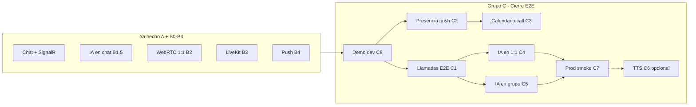

# SignTrack — Plan de cierre End-to-End (Grupo C)

> Rama: `ft/sajche` · Metodología: **2 agentes por bloque** (Backend + Frontend)  
> Objetivo: producto **completo y demostrable** — chat, llamadas 1:1, llamadas grupales, IA de señas en chat **y en videollamada**, push, calendario → reunión.

---

## Estado real hoy (2026-07-16)

| Área | Hecho | Falta para E2E |
|------|-------|----------------|
| Grupo A (REST + UI) | ✅ | Pulido menor |
| B1 Chat SignalR | ✅ | — |
| B1.5 IA en **chat** | ✅ | — |
| B2 Video 1:1 WebRTC | ✅ | Pruebas 2 redes, coturn prod |
| B3 LiveKit grupal | ✅ | Prueba 4 usuarios en demo |
| B4 Push + badge | ✅ | — |
| B5 IA en **llamada** | ✅ | Prueba E2E en exposición |
| Calendario → reunión | ✅ | `POST /appointments/{id}/start` |
| Registro demo | ✅ | Auto-activar en dev + seed |
| Presencia online | ✅ | — |
| Smoke test API | ✅ | `pnpm smoke:e2e` |
| Producción VPS | 📋 guía | Despliegue real |

---

## Metodología — 2 agentes por bloque

Cada bloque **C1…C8** se trabaja en **paralelo** con dos roles:

| Agente | Repo / stack | Responsabilidad |
|--------|--------------|-----------------|
| **Agente Backend** | `SignTrack-sandbox-ft-sajche` — Identity, Messaging, Calls, Gateway, Recognition (solo integración, no reentrenar modelos) | APIs, hubs SignalR, tokens, migraciones, config |
| **Agente Frontend** | `SignTrack-frontend` — React + Vite | UI, WebRTC/LiveKit, panel IA, service worker |

**Regla:** no mezclar commits gigantes; cada bloque cierra su **DoD** antes de pasar al siguiente.

**Recognition:** integrar vía Gateway `/recognition-api` — **no modificar lógica ML** salvo bugs de API (`predict-letter` base64 ya existe).

---

## Orden de ejecución (Grupo C)

```
C8 (dev/demo) ──► C1 (llamadas E2E) ──► C4 (IA 1:1) ──► C5 (IA grupal)
       │                    │
       └──── C2 (presencia/push) ──► C3 (calendario↔call)
                                          │
                                    C7 (prod + smoke)
                                          │
                                    C6 (TTS opcional)
```

---

## C1 — Llamadas E2E (1:1 + grupal)

**DoD:** Dos cuentas en distintas pestañas se ven/oyen en 1:1; 3+ cuentas en LiveKit con chat lateral; errores claros si falta cámara/LiveKit.

| ID | Agente Backend | Agente Frontend |
|----|----------------|-----------------|
| C1-1 | Hub Calls: evento `RoomEnded` al `POST /rooms/{id}/end` | Escuchar evento → redirigir + limpiar peers |
| C1-2 | `iceServers` dev con coturn opcional en `docker-compose.yml` | Mensajes UX: “Esperando participante”, “Reconectando hub…” |
| C1-3 | Health agregado en Gateway `/api/v1/services` incl. LiveKit | Indicador en sala si Recognition/LiveKit offline |
| C1-4 | Validar join cuando room `ended` | Botón “Unirse” en lista si sala activa |
| C1-5 | — | Importar estilos `@livekit/components-styles` (grid legible) |
| C1-6 | — | Extraer `MeshCallRoom.jsx` de `CallRoomPage` (mantenibilidad) |

**Prueba E2E C1:**
1. María + Carlos → reunión **1:1** → video/audio bidireccional.
2. Ana + Carlos + Luis + María → reunión **Grupo** → LiveKit + chat lateral.

---

## C2 — Presencia, solicitudes y push

**DoD:** Punto verde en contactos; solicitud de contacto → push; badge chats actualizado al recibir mensaje.

| ID | Agente Backend | Agente Frontend |
|----|----------------|-----------------|
| C2-1 | Redis: mapa `userId → online` + hub `GetOnlineUsers` o reutilizar `UserOnline` | Punto verde en `ContactsPage` |
| C2-2 | Push al crear `UserRequest` (Messaging o Identity webhook) | Toast + badge en Solicitudes |
| C2-3 | `GET /conversations` incluye `unreadCount` por chat (ya parcial) | Badge por conversación en `ChatsPage` |
| C2-4 | — | Al recibir `ReceiveMessage` SignalR → incrementar badge sin refresh |

**Prueba E2E C2:** Usuario A offline (cierra pestaña) → B envía mensaje → A recibe push del navegador.

---

## C3 — Calendario ↔ Reuniones

**DoD:** Desde evento de calendario se crea/abre `CallRoom` con invitados como participantes.

| ID | Agente Backend | Agente Frontend |
|----|----------------|-----------------|
| C3-1 | `POST /appointments/{id}/start` → crea `CallRoom` + vincula `roomId` | Botón “Iniciar videollamada” en detalle de cita |
| C3-2 | Al crear cita tipo `meeting`, pre-crear room `waiting` opcional | Modal cita: checkbox “Crear sala de reunión” |
| C3-3 | Notificar participantes (push o request) | Link “Unirse” en notificación |

**Prueba E2E C3:** Agendar cita con 2 invitados → Iniciar → ambos entran a la misma sala.

---

## C4 — IA de señas en videollamada 1:1 (WebRTC)

**DoD:** Durante llamada mesh, quien firma ve panel cámara; el otro ve subtítulos en chat lateral o overlay.

| ID | Agente Backend | Agente Frontend |
|----|----------------|-----------------|
| C4-1 | — (Recognition ya expuesto) | Reutilizar `SignLanguagePanel` adaptado a `MeshCallRoom` |
| C4-2 | — | Capturar frame del `<video>` local (canvas) → `predictLetterFromFrame` |
| C4-3 | Mensajes `type: translation` en conversación `call-room/{roomId}` (ya existe API) | Enviar traducción al **CallSideChat** de la reunión 1:1 (añadir panel chat opcional en mesh) |
| C4-4 | — | Burbujas `translation` distintas en chat de llamada |
| C4-5 | — | Toggle “Modo señas” en barra de controles de llamada |

**Prueba E2E C4:** María firma en llamada 1:1 → Carlos ve texto en chat lateral en vivo.

---

## C5 — IA de señas en videollamada grupal (LiveKit)

**DoD:** Mismo flujo B1.5 pero dentro de `LiveKitCallRoom`.

| ID | Agente Backend | Agente Frontend |
|----|----------------|-----------------|
| C5-1 | — | `SignLanguagePanel` en columna junto a `VideoConference` |
| C5-2 | — | Overlay de subtítulos flotante (última frase firmada) visible para todos |
| C5-3 | — | Traducciones van al `CallSideChat` vía `sendTranslationMessage` |
| C5-4 | Opcional: hub evento `ReceiveTranslation` en Calls (broadcast subtítulo) | Sincronizar overlay vía SignalR chat (más simple: solo chat) |

**Prueba E2E C5:** 3 usuarios en LiveKit; uno firma → los otros ven texto en chat + overlay.

---

## C6 — TTS para oyentes (opcional)

**DoD:** Botón “Leer en voz alta” en mensajes `translation` (Web Speech API).

| ID | Agente Backend | Agente Frontend |
|----|----------------|-----------------|
| C6-1 | — | `speechSynthesis` en español para burbujas translation |
| C6-2 | — | Toggle auto-TTS en perfil/accesibilidad |

---

## C7 — Producción + smoke test

**DoD:** Checklist ejecutado; app en HTTPS con TURN; demo grabable.

| ID | Agente Backend / DevOps | Agente Frontend |
|----|-------------------------|-----------------|
| C7-1 | Desplegar `docker-compose.prod.yml` en VPS | `VITE_LIVEKIT_URL=wss://dominio/livekit` en build |
| C7-2 | coturn con credenciales en `WebRtc:IceServers` | — |
| C7-3 | Variables VAPID + LiveKit prod | Service worker en HTTPS |
| C7-4 | Script `scripts/smoke-e2e.mjs` (login → chat → room) | — |
| C7-5 | — | Build prod + verificar `/signtrack/` |

**Checklist smoke (manual):**

- [ ] Login demo × 4 cuentas
- [ ] Chat en vivo sin refresh
- [ ] Modo señas en chat
- [ ] Llamada 1:1 con video
- [ ] Llamada grupal LiveKit
- [ ] Modo señas en llamada
- [ ] Push de mensaje
- [ ] Calendario → iniciar reunión

---

## C8 — Dev experience + demo Kinal (hacer primero)

**DoD:** Un comando levanta todo; cuentas demo listas; registro funciona sin verificar email en dev.

| ID | Agente Backend | Agente Frontend |
|----|----------------|-----------------|
| C8-1 | `Auth:AutoActivateInDevelopment` → `Status=true` al registrar | — |
| C8-2 | `pnpm seed:demo` en `package.json` → `seed-demo-users.mjs` | — |
| C8-3 | `start-all.mjs` ejecuta seed si `SEED_DEMO=1` | — |
| C8-4 | — | README demo: 4 cuentas + flujo profesor |
| C8-5 | Documentar en `docs/DEMO_SCRIPT.md` guión 10 min para exposición | — |

---

# Resumen visual



---

# Asignación sprint (2 agentes × 4 sprints)

| Sprint | Agente Backend | Agente Frontend | Entrega |
|--------|----------------|-----------------|---------|
| **SC-1** | C8-1, C8-2, C1-1, C1-2 | C8-4, C1-5, C1-6 | Demo + llamadas estables |
| **SC-2** | C2-1, C2-2, C3-1 | C2-3, C2-4, C3 botones | Presencia + calendario→call |
| **SC-3** | C4-3 (call-room chat) | C4 panel IA mesh, C5 panel LiveKit | **IA en videollamadas** |
| **SC-4** | C7-1…C7-4 | C7-5, C6 TTS si hay tiempo | Prod + exposición Kinal |

---

# Qué NO tocar

- `services/recognition/**` — modelos, entrenamiento, datasets
- Reentrenar MediaPipe / Neon
- Commits/push hasta tener permisos GitHub resueltos

---

# Siguiente paso inmediato

**Grupo C implementado en `ft/sajche`.** Pendiente:

1. Levantar stack (`pnpm start:all`) y ejecutar `pnpm smoke:e2e`
2. Prueba manual con 2–4 cuentas demo (ver `docs/DEMO_SCRIPT.md`)
3. Despliegue prod (C7) cuando haya VPS

**Rama:** solo `ft/sajche` — `develop` no se modifica.

---

*Documento: `docs/E2E_COMPLETION_PLAN.md` · Complementa `TEAMS_ROADMAP.md`*
