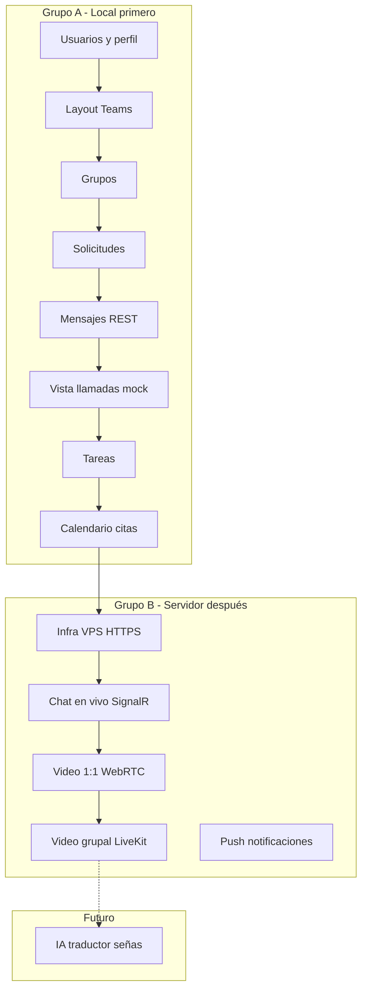

# SignTrack — Roadmap Teams (plan de trabajo)

> Rama: `ft/sajche` · Frontend: `SignTrack-frontend` · Backend: `SignTrack`  
> **IA / Recognition:** fuera de alcance en esta fase (no conectar traductor de señas aún).

Este documento organiza el trabajo en **dos grupos**:

| Grupo | Nombre | Dónde se trabaja | Objetivo |
|-------|--------|------------------|----------|
| **A** | Local / app extra | PC dev, Docker local, REST + UI | Pantallas, datos, flujos sin tiempo real |
| **B** | Servidor + tiempo real | VPS, HTTPS, SignalR, WebRTC, TURN | Mensajes en vivo, videollamadas reales |

---

## Estado actual (baseline)

| Área | Hecho | Falta |
|------|-------|-------|
| Auth (login, registro, JWT) | ✅ | forgot/reset password UI |
| Perfil | Lectura ✅ | Edición |
| Usuarios admin | Lista parcial ✅ | Todos los roles, cambiar rol |
| Dashboard | Placeholder ✅ | Navegación y widgets |
| Gateway | Scaffold | YARP proxy |
| Calls / Messaging | Scaffold | Todo |
| Chat / grupos / calendario | — | Todo Grupo A |
| Tiempo real / video | — | Todo Grupo B |

---

# GRUPO A — Local (primero)

> Se puede avanzar **sin VPS**, **sin SignalR en producción** y **sin WebRTC real**.  
> Stack: Identity `:5104`, Postgres Docker, frontend `:5180/signtrack`, REST.

## A1. Completar usuarios (Identity + frontend)

| ID | Tarea | Backend | Frontend | Prioridad |
|----|-------|---------|----------|-----------|
| A1-1 | Editar perfil (nombre, teléfono, foto) | `PUT /api/v1/users/me` ya existe | Formulario en `/dashboard/profile` | Alta |
| A1-2 | Listar **todos** los usuarios (USER + ADMIN) | Nuevo endpoint o ampliar `by-role` | Tabla admin con filtros | Alta |
| A1-3 | Cambiar rol de usuario | `PUT /users/{id}/role` ya existe | Acción en tabla admin | Alta |
| A1-4 | Buscar usuario por nombre/email | Query en Identity | Input búsqueda admin | Media |
| A1-5 | Pantallas forgot / reset password | Endpoints ya existen | `/forgot-password`, `/reset-password` | Media |

**DoD A1:** Admin gestiona usuarios; cualquier usuario edita su perfil. ✅ *(SA-1, commits backend `5529b1d`, frontend `d8ed29d`)*

---

## A2. Shell Teams (layout y navegación)

| ID | Tarea | Backend | Frontend | Prioridad |
|----|-------|---------|----------|-----------|
| A2-1 | Layout 3 columnas (sidebar + contenido + panel) | — | Refactor `MainLayout` | Alta |
| A2-2 | Sidebar: Inicio, Chats, Llamadas, Tareas, Calendario | — | Rutas bajo `/signtrack/` | Alta |
| A2-3 | Dashboard con accesos rápidos | — | Cards con links reales | Media |
| A2-4 | Limpiar código legacy (restaurant, reservations) | — | Borrar services/stores no usados | Alta |

**DoD A2:** Navegación clara tipo Teams; sin archivos muertos de otro proyecto. ✅ *(SA-1, commit frontend `5e4e0ee`)*

---

## A3. Grupos y contactos

| ID | Tarea | Backend | Frontend | Prioridad |
|----|-------|---------|----------|-----------|
| A3-1 | Modelo `Group` + `GroupMember` | EF en Identity o Messaging | — | Alta |
| A3-2 | `POST /api/v1/groups` — crear grupo | Controller + migración | Modal “Crear grupo” | Alta |
| A3-3 | `GET /api/v1/groups` — mis grupos | Listar por userId | Sidebar lista grupos | Alta |
| A3-4 | `POST /api/v1/groups/{id}/members` — añadir miembro | Solo owner/admin grupo | UI invitar desde usuarios | Alta |
| A3-5 | `DELETE /api/v1/groups/{id}/members/{userId}` | Quitar miembro | UI admin grupo | Media |
| A3-6 | Lista de contactos / usuarios disponibles | Reutilizar users | Panel “Contactos” | Media |

**DoD A3:** Crear grupo, ver mis grupos, añadir/quitar miembros vía REST. ✅ *(SA-2, backend `1c34597`, frontend `6de1245`)*

---

## A4. Solicitudes entre usuarios

| ID | Tarea | Backend | Frontend | Prioridad |
|----|-------|---------|----------|-----------|
| A4-1 | Modelo `UserRequest` (tipo: `group_invite`, `contact`, `meeting`) | EF + estados: pending/accepted/rejected | — | Alta |
| A4-2 | `POST /api/v1/requests` — enviar solicitud | Crear registro | Botón “Invitar” / “Solicitar unirse” | Alta |
| A4-3 | `GET /api/v1/requests/inbox` — bandeja entrante | Filtrar por destinatario | Vista notificaciones/solicitudes | Alta |
| A4-4 | `PATCH /api/v1/requests/{id}` — aceptar/rechazar | Actualizar estado + side effects | Botones Aceptar / Rechazar | Alta |

**DoD A4:** Usuario A invita a B a un grupo; B ve solicitud y acepta/rechaza. ✅ *(SA-2)*

---

## A5. Mensajes (histórico REST — sin tiempo real)

| ID | Tarea | Backend | Frontend | Prioridad |
|----|-------|---------|----------|-----------|
| A5-1 | Modelo `Conversation` (dm \| group) + `Message` | Messaging EF + migración | — | Alta |
| A5-2 | `POST /conversations` — abrir DM o usar groupId | Messaging API | Abrir chat desde contacto/grupo | Alta |
| A5-3 | `GET /conversations` — lista con último mensaje | Join + preview | Lista chats sidebar | Alta |
| A5-4 | `POST /conversations/{id}/messages` — enviar | Persistir en Postgres | Input + botón Enviar | Alta |
| A5-5 | `GET /conversations/{id}/messages` — historial paginado | Cursor/limit | Scroll burbujas | Alta |
| A5-6 | Vista mensajes unificada | — | Panel central chat | Alta |

> **Nota Grupo A:** el otro usuario **no ve el mensaje al instante** hasta refrescar o polling. Eso es Grupo B.

**DoD A5:** Chat 1:1 y de grupo con historial guardado; enviar y recargar página muestra mensajes.

---

## A6. Vista llamadas (UI + metadata — sin video real)

| ID | Tarea | Backend | Frontend | Prioridad |
|----|-------|---------|----------|-----------|
| A6-1 | Modelo `CallRoom` (title, host, status, conversationId?) | Calls EF + migración | — | Alta |
| A6-2 | `POST /api/v1/rooms` — crear reunión | Calls controller | Botón “Nueva reunión” | Alta |
| A6-3 | `GET /api/v1/rooms` — historial / activas | Listar salas del usuario | Vista `/calls` | Alta |
| A6-4 | `POST /api/v1/rooms/{id}/join` — unirse (solo registro) | Participant en DB | Pantalla “Unirse a reunión” | Alta |
| A6-5 | UI sala de llamada (mock) | — | Grid placeholders cámara/mic (sin WebRTC) | Media |
| A6-6 | Enlace compartible ` /signtrack/calls/{roomId}` | — | Copiar enlace | Media |

**DoD A6:** Crear reunión, ver lista, entrar a pantalla de sala; **sin video/audio real**.

---

## A7. Tareas

| ID | Tarea | Backend | Frontend | Prioridad |
|----|-------|---------|----------|-----------|
| A7-1 | Modelo `TaskItem` (title, assignee, groupId?, dueDate, status) | Nuevo módulo o Messaging | — | Media |
| A7-2 | CRUD `/api/v1/tasks` | REST | Vista `/tasks` lista + crear | Media |
| A7-3 | Tareas por grupo | Filtrar por groupId | Tab en detalle de grupo | Baja |
| A7-4 | Asignar tarea a usuario del grupo | Validar membresía | Dropdown miembros | Baja |

**DoD A7:** CRUD tareas básico en UI.

---

## A8. Calendario y citas

| ID | Tarea | Backend | Frontend | Prioridad |
|----|-------|---------|----------|-----------|
| A8-1 | Modelo `Appointment` (title, start, end, participants[], roomId?) | EF + migración | — | Media |
| A8-2 | CRUD `/api/v1/appointments` | REST | Vista `/calendar` | Media |
| A8-3 | Vista calendario mensual/semanal | — | Componente calendario (lib ligera) | Media |
| A8-4 | Agendar cita con usuarios invitados | Crear + UserRequest tipo `meeting` | Modal agendar | Media |
| A8-5 | Vincular cita → CallRoom al iniciar | Crear room al click “Iniciar” | Botón en evento | Baja |

**DoD A8:** Ver calendario, crear cita, invitar participantes (REST).

---

## A9. Gateway local (opcional en Grupo A)

| ID | Tarea | Backend | Frontend | Prioridad |
|----|-------|---------|----------|-----------|
| A9-1 | YARP proxy Identity | Gateway `:5000` | — | Media |
| A9-2 | Proxy Groups, Messages, Tasks, Appointments | Según servicio | — | Media |
| A9-3 | Frontend apunta a `:5000` | — | `.env` + vite proxy | Media |

**DoD A9:** Un solo puerto API en local.

---

### Orden sugerido Grupo A

```
A1 (usuarios) → A2 (layout) → A3 (grupos) → A4 (solicitudes)
     → A5 (mensajes REST) → A6 (vista llamadas mock)
     → A7 (tareas) → A8 (calendario) → A9 (gateway)
```

### Sprint mapping Grupo A (propuesta)

| Sprint | Duración | Entregables |
|--------|----------|-------------|
| **SA-1** | 2 sem | A1 + A2 + limpieza legacy |
| **SA-2** | 2 sem | A3 + A4 (grupos + solicitudes) |
| **SA-3** | 2 sem | A5 (chat REST) |
| **SA-4** | 2 sem | A6 (vista llamadas mock) |
| **SA-5** | 2 sem | A7 + A8 (tareas + calendario) |

---

# GRUPO B — Servidor + tiempo real (después)

> Requiere **despliegue en internet**, **HTTPS/WSS**, **SignalR**, **WebRTC**, **TURN** (y opcional **LiveKit** para grupos).  
> **IA excluida** en esta fase.

## B0. Infraestructura

| ID | Tarea | Detalle |
|----|-------|---------|
| B0-1 | VPS (4 GB RAM mínimo) | Hetzner / DO / Azure student |
| B0-2 | Dominio + HTTPS | Nginx/Caddy + Let's Encrypt |
| B0-3 | `docker-compose.prod.yml` | Postgres, Redis, servicios C#, coturn |
| B0-4 | Variables entorno producción | JWT, connection strings, CORS `:5180` + dominio |
| B0-5 | CI/CD básico | Build + deploy rama `develop` / tags |

**DoD B0:** App accesible por URL pública con HTTPS.

---

## B1. Mensajes en vivo

| ID | Tarea | Backend | Frontend |
|----|-------|---------|----------|
| B1-1 | SignalR hub en Messaging | `ReceiveMessage`, `UserTyping` | Conectar hub con JWT |
| B1-2 | Redis backplane SignalR | Escalar instancias | — |
| B1-3 | Tras `POST /messages` → broadcast hub | Integrar persist + push | Actualizar UI sin refresh |
| B1-4 | Indicador “escribiendo…” | Evento typing | UI burbuja |
| B1-5 | Presencia online/offline | Redis + hub | Punto verde en contactos |

**DoD B1:** Dos usuarios en distintas redes ven mensajes al instante.

---

## B2. Videollamada 1:1 real

| ID | Tarea | Backend | Frontend |
|----|-------|---------|----------|
| B2-1 | SignalR hub en Calls | Offer, Answer, IceCandidate | RTCPeerConnection |
| B2-2 | Devolver `iceServers` al join | Config STUN/TURN | `RTCPeerConnection` config |
| B2-3 | coturn en Docker prod | STUN + TURN credentials | — |
| B2-4 | UI cámara/mic real | — | getUserMedia, mute, colgar |
| B2-5 | JWT en hub Calls | Validar en connect | Token en SignalR |

**DoD B2:** Dos usuarios en internet se ven y oyen.

---

## B3. Videollamada grupal

| ID | Tarea | Backend | Frontend |
|----|-------|---------|----------|
| B3-1 | Integrar LiveKit server (Docker) | Token API desde Calls | `@livekit/components-react` |
| B3-2 | Grid N participantes | — | UI sala grupal |
| B3-3 | Chat lateral en reunión | Reutilizar B1 en room | Panel mensajes en call |

**DoD B3:** Reunión estable de 4–8 personas.

---

## B4. Notificaciones push (opcional)

| ID | Tarea | Detalle |
|----|-------|---------|
| B4-1 | Web Push o email SMTP real | Solicitudes, mensajes offline |
| B4-2 | Badge contador inbox | Frontend service worker |

---

## B5. IA / traductor de señas (fase futura — no ahora)

| ID | Tarea | Notas |
|----|-------|-------|
| B5-1 | Proxy Recognition vía Gateway | No tocar `services/recognition/**` |
| B5-2 | Frame cámara → predict-letter | Durante llamada |
| B5-3 | Mensaje `type: translation` en chat | Grupo B1 |
| B5-4 | TTS para oyentes | Opcional |

> **Explícitamente pospuesto.** Grupo A y B primero.

---

### Orden sugerido Grupo B

```
B0 (infra) → B1 (chat vivo) → B2 (video 1:1) → B3 (video grupal) → B4 (push)
                                                                    ↘ B5 (IA) mucho después
```

---

# Resumen visual



---

# Asignación sugerida por rol

| Rol | Grupo A | Grupo B |
|-----|---------|---------|
| **Backend C#** | A1, A3–A8 APIs, migraciones EF | B0, B1–B3 hubs, TURN config |
| **Frontend React** | A2, todas las vistas | B1–B3 WebRTC / LiveKit UI |
| **DevOps** | Docker local, A9 Gateway | B0 producción |
| **IA** | — | B5 (futuro) |

---

# Referencias

- Arquitectura: `docs/ARCHITECTURE.md`
- Backlog Scrum: `docs/SCRUM_BACKLOG.md`
- Contrato API: `shared/contracts/teams-api-v1.md`
- Integración frontend: `docs/FRONTEND_INTEGRATION.md`

---

*Última actualización: 2026-07-15 · Rama `ft/sajche`*
